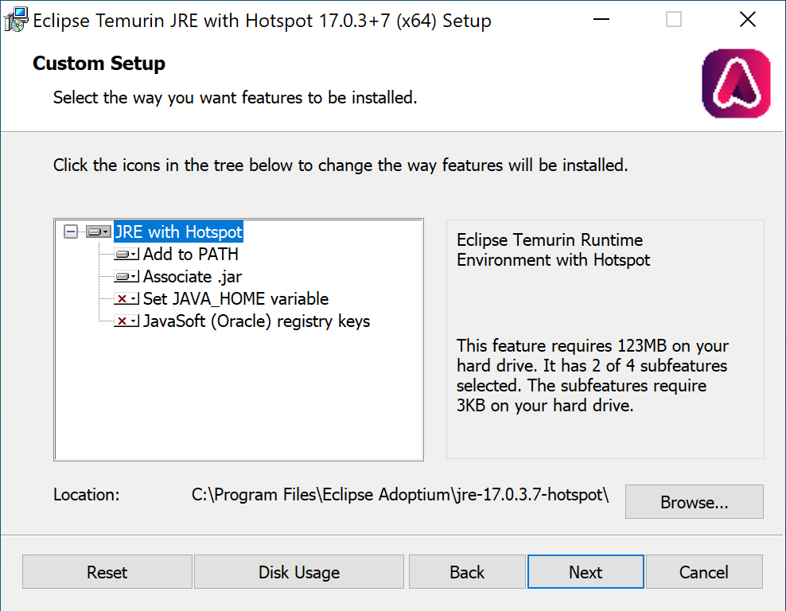
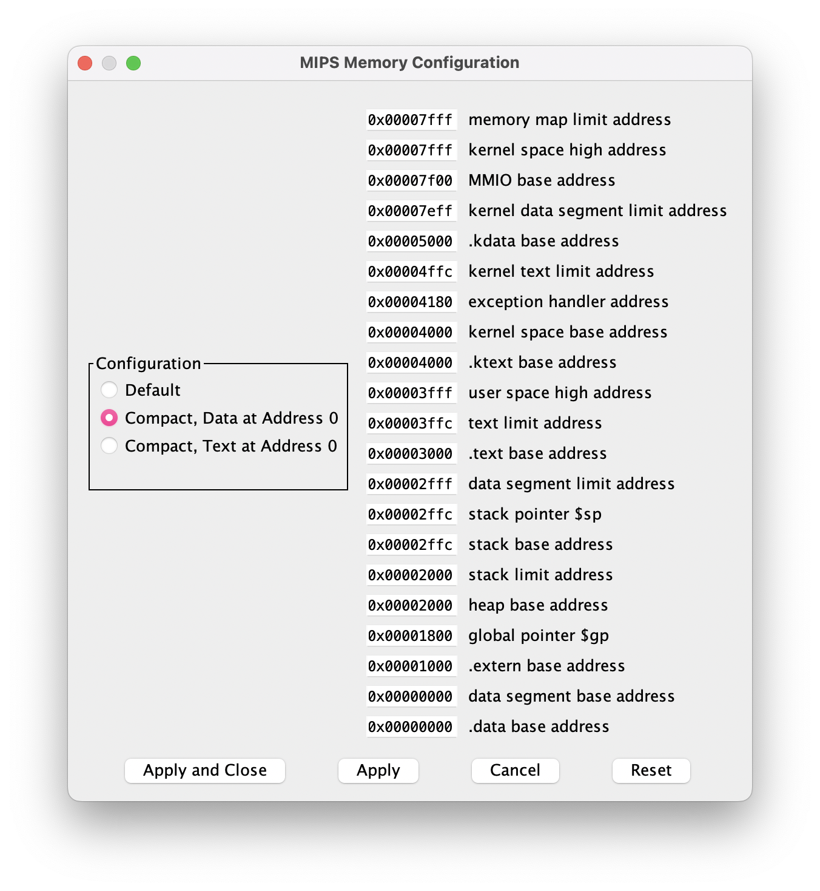
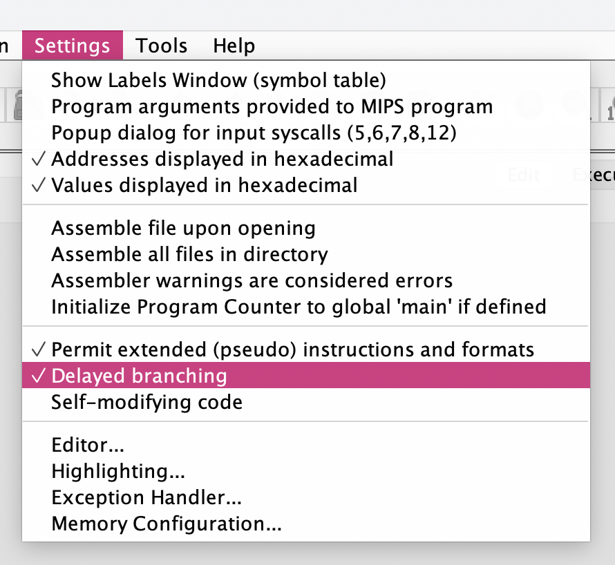
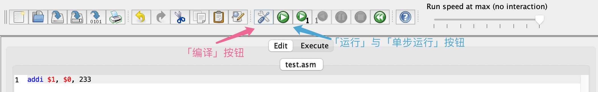
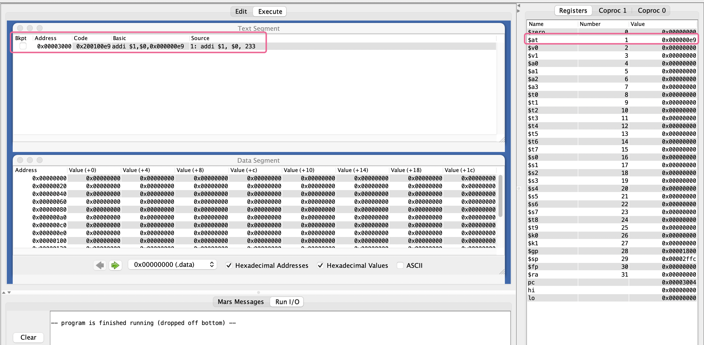
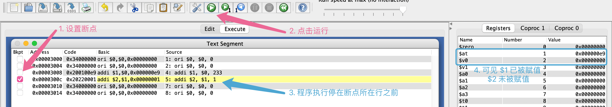

# Mars

Mars（MIPS Assembler and Runtime Simulator，MIPS 汇编与运行时模拟器）是一个简易的用于 MIPS 汇编教学的虚拟机。它提供了带有指令提示的代码编辑器和图形化的单步调试环境。可用于学习 MIPS 指令集与检验你的 CPU 设计正确性。

## Java 运行环境

Mars 运行在 Java 环境上，你需要下载安装 Java 运行环境（Java Runtime Environment，JRE）来运行 Mars。

### Linux

从发行版的官方软件源安装 Java：

```bash
# Arch Linux / Manjaro
sudo pacman -Sy jre17-openjdk

# Ubuntu / Debian
sudo apt update && sudo install openjdk-17-jre
```

### macOS

使用 Homebrew 安装 Java（如果没有安装 Homebrew，请[根据此向导](https://mirrors.tuna.tsinghua.edu.cn/help/homebrew/)安装）：

```bash
brew install openjdk@17
```

并执行以下命令向系统注册 Java：

```bash
sudo ln -sfn /opt/homebrew/opt/openjdk@17/libexec/openjdk.jdk /Library/Java/JavaVirtualMachines/openjdk-17.jdk
```

### Windows

从 TUNA 镜像站下载 [Adoptium OpenJDK](https://mirrors.tuna.tsinghua.edu.cn/Adoptium/17/jre/x64/windows/) 的 MSI 安装包并点击运行以安装。

在安装过程中保持默认选项（保持「Add to PATH」选中）即可。



## 下载 Mars

点击此处下载 [Mars](/assets/Mars.jar) 程序，下载后将其放在任意位置（建议放置在便于输入路径的位置，以方便命令行调用）。

## GUI 设置

### 内存布局

点击菜单中的 Settings → Memory Configuration… 选项：


在弹出的窗口中设置内存布局为「Compact, Data at Address 0」：



并点击下方最左侧的「Apply and Close」按钮。

### 延迟分支

同样是在 Settings 菜单中，可以切换是否开启延迟分支（Delayed branching）选项。**请根据作业要求设置是否开启该选项。**



## 编写并运行 MIPS 程序

点击工具栏最左侧的「新建」按钮（或菜单中的 File → New 选项）新建一个 MIPS 程序，新建后按下 <kbd>Ctrl + S</kbd>（macOS 下为 <kbd>Command + S</kbd>）保存。保存文件后，工具栏上的「编译」按钮变得可用：



点击「编译」按钮后，Mars 将你所编写的 MIPS 代码编译为 MIPS 字节码，并展示在运行（Execute）视图中（如果需要返回修改 MIPS 代码，可以点击工具栏下方的按钮切换回编辑（Edit）视图）。此时点击工具栏上的「运行」按钮即可运行该程序：



如上图所示，Mars 中的 MIPS 程序运行完成后，寄存器的值发生变化。由于该程序没有写入内存，所以内存的值没有变化。

## 调试 MIPS 程序

在运行（Execute）视图中点击某行左侧的复选框，在该行处设置断点，并点击工具栏上的「运行」按钮：



可见程序停在了断点所在行**之前**。

此时点击工具栏上的「单步执行」按钮（在「运行」按钮的右侧），即可执行下一条指令，此时可观测到内存和寄存器的变化。如果希望回退到上一步状态，可以点击「单步回退」按钮（在「单步执行」按钮的右侧）进行回退。

## Mars 系统调用

Mars 为 MIPS 程序提供了一系列**系统调用（syscalls）**，其中常用的系统调用如下：

|编号（`$v0`）|名称|描述|
|:---------:|:--:|:--:|
|1|输出整数|输出 `$a0` 中的整数（不换行）|
|5|输入整数|读入一个整数到 `$a0`（整行读入）|
|4|输出字符串|输出 `$a0` 所指向内存地址的字符串（以 `\0` 结束）|

要使用系统调用，首先将其编号赋值给 `$v0`，并准备好要传递的参数，最后使用 `syscall` 指令进行调用。

## 命令行用法

以下是常用的 Mars 命令行用法。相关命令行参数的含义请自行理解或查询 Mars 文档。

```bash
# 编译 MIPS 源程序到十六进制文本形式的字节码（用于在 Verilog 中读入）
java <Mars.jar 的路径> dump .text HexText <输出的 .txt 十六进制代码文件> a nc mc CompactDataAtZero <输入的 .asm 汇编源文件>

# 执行 MIPS 源程序（开启延迟分支；其中 50000 为最大的执行步数）
java <Mars.jar 的路径> db nc 50000 ae2 mc CompactDataAtZero <输入的 .asm 汇编源文件>

# 执行 MIPS 源程序（关闭延迟分支；其中 50000 为最大的执行步数）
java <Mars.jar 的路径> nc 50000 ae2 mc CompactDataAtZero <输入的 .asm 汇编源文件>
```

请将 `<Mars.jar 的路径>` 这段文本替换为 Mars.jar 的路径（最终命令中**没有**两侧 `<` ``>` 符号），可以将 Mars.jar 拖动到命令行窗口中来便捷地输入路径。其余路径同理。


!!! warning "警告"
    当编译出的 MIPS 字节码无法填满你在 Verilog 中编写的指令存储器时，使用 `$readmemh` 读入后，存储器的空余部分的值可能会是 `X`。
    
    如果你不希望这里出现 `X`，请手动清零或将字节码文本文件填充到足够长。
